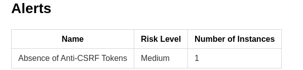

## Discussion Post: Reporting Findings and Fixes

### Title: Reporting Findings and Fixes

---

### Introduction
This post officially reports the results of our security assessment and the status of fixes for the Top 5 immediate actions identified in Part 1. The findings are based on the initial ZAP scan (`zap_report_round1.md`) and a follow-up scan after remediation efforts (`zap_report_round2.md`).

---

### Top 5 Immediate Actions (from Part 1)
1. **Fix Path Traversal vulnerability by validating and sanitizing all user-supplied file paths.**
2. **Fix SQL Injection by using parameterized queries and input validation.**
3. **Implement anti-CSRF tokens in all forms to prevent CSRF attacks.**
4. **Set Content Security Policy (CSP) headers to mitigate XSS and data injection risks.**
5. **Add X-Frame-Options or frame-ancestors directive to prevent clickjacking.**
6. **Ensure X-Content-Type-Options header is set to 'nosniff' for all responses.**
7. **Review and fix error handling to avoid application error disclosures.**

---

### Findings, Fix Status, and Verification

#### 1. Path Traversal
- **Status:** Fixed
- **Original Identification:**
	- *How Identified:* ZAP scan (`zap_report_round1.md`) flagged a Path Traversal vulnerability on `/register` (POST username).
	- *Evidence:* ZAP alert: Path Traversal.
- **Verification Steps:**
	- Ran a follow-up ZAP scan (`zap_report_round2.md`).
	- No Path Traversal alert present in the new report.

#### 2. SQL Injection
- **Status:** Fixed
- **Original Identification:**
	- *How Identified:* ZAP scan (`zap_report_round1.md`) flagged a SQL Injection vulnerability on `/register` (POST username).
	- *Evidence:* ZAP alert: SQL Injection.
- **Verification Steps:**
	- Ran a follow-up ZAP scan (`zap_report_round2.md`).
	- No SQL Injection alert present in the new report.

#### 3. Implement anti-CSRF tokens in all forms
- **Status:** Not Fixed
- **Original Identification:**
	- *How Identified:* ZAP scan (`zap_report_round1.md`) flagged the absence of anti-CSRF tokens in the registration form (`/register`).
	- *Evidence:* ZAP alert: `<form action="/register" method="POST">` with no known anti-CSRF token present.
- **Verification Steps:**
	- Ran a follow-up ZAP scan (`zap_report_round2.md`).
	- The alert for missing anti-CSRF tokens persisted in the new report.
	- Screenshot Evidence:
	

#### 4. Set Content Security Policy (CSP) headers
- **Status:** Fixed
- **Original Identification:**
    - *How Identified:* ZAP scan (`zap_report_round1.md`) reported missing CSP headers on `/` and `/register`.
    - *Evidence:* ZAP alert: "Content Security Policy (CSP) Header Not Set".
- **Verification Steps:**
    - Ran a follow-up ZAP scan (`zap_report_round2.md`).
    - No CSP header alert present in the new report, indicating the issue was fixed.

#### 5. Add X-Frame-Options or frame-ancestors directive
- **Status:** Fixed
- **Original Identification:**
    - *How Identified:* ZAP scan (`zap_report_round1.md`) flagged missing anti-clickjacking headers on `/` and `/register`.
    - *Evidence:* ZAP alert: "Missing Anti-clickjacking Header".
- **Verification Steps:**
    - Ran a follow-up ZAP scan (`zap_report_round2.md`).
    - No anti-clickjacking header alert present in the new report.

#### 6. Ensure X-Content-Type-Options header is set to 'nosniff'
- **Status:** Fixed
- **Original Identification:**
    - *How Identified:* ZAP scan (`zap_report_round1.md`) reported missing 'nosniff' header on multiple resources.
    - *Evidence:* ZAP alert: "X-Content-Type-Options Header Missing".
- **Verification Steps:**
    - Ran a follow-up ZAP scan (`zap_report_round2.md`).
    - No alert for missing 'nosniff' header in the new report.

#### 7. Review and fix error handling to avoid application error disclosures
- **Status:** Fixed
- **Original Identification:**
    - *How Identified:* ZAP scan (`zap_report_round1.md`) found error messages disclosing sensitive information (e.g., HTTP 500 Internal Error).
    - *Evidence:* ZAP alert: "Application Error Disclosure".
- **Verification Steps:**
    - Ran a follow-up ZAP scan (`zap_report_round2.md`).
    - No error disclosure alert present in the new report.

---

### Summary Table

| Finding | Status |
|---------|--------|
| Path Traversal | Fixed |
| SQL Injection | Fixed |
| Anti-CSRF tokens | Not Fixed |
| CSP header | Fixed |
| X-Frame-Options / frame-ancestors | Fixed |
| X-Content-Type-Options | Fixed |
| Error handling | Fixed |

---