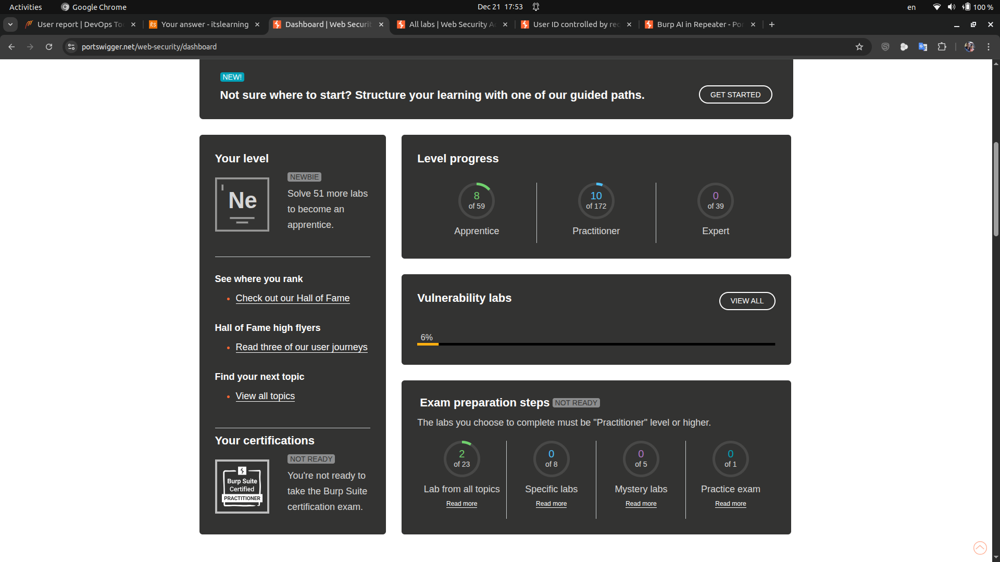

# Final Report

---

## PortSwigger

**Screenshot of Completed Labs:**

**Completed Labs List:**

### SQL Injection

- SQL injection vulnerability in WHERE clause allowing retrieval of hidden data
- SQL injection vulnerability allowing login bypass
- SQL injection attack, querying the database type and version on Oracle
- SQL injection attack, querying the database type and version on MySQL and Microsoft
- SQL injection attack, listing the database contents on non-Oracle databases
- SQL injection attack, listing the database contents on Oracle
- SQL injection UNION attack, determining the number of columns returned by the query
- SQL injection UNION attack, finding a column containing text
- SQL injection UNION attack, retrieving data from other tables
- SQL injection UNION attack, retrieving multiple values in a single column

### Access Control Vulnerabilities

- Unprotected admin functionality
- Unprotected admin functionality with unpredictable URL
- User role can be modified in user profile
- User ID controlled by request parameter

### Authentication

- Username enumeration via different responses
- Password reset broken logic
- Username enumeration via subtly different responses
- Username enumeration via response timing

---

## The Booking System Project

### Phase 1: Initial Security Assessment

**What was done:**

- Deployed the booking system using Docker Compose.
- Performed a comprehensive vulnerability assessment using OWASP ZAP.
- The ZAP scan identified the following issues with part1 ([zap_report_round1.md](https://github.com/Muditha-Kumara/IT00AK39-3005-Cybersecurity-and-data-privacy/blob/main/BookingSystem-Phase1/ZAP_Report/zap_report_round1.md)):
	 - **High risk:**
		  - Path Traversal (on /register, POST username)
		  - SQL Injection (on /register, POST username)
	 - **Medium risk:**
		  - Absence of Anti-CSRF Tokens (on /register form)
		  - Content Security Policy (CSP) Header Not Set (on / and /register)
		  - Missing Anti-clickjacking Header (on / and /register)
	 - **Low risk:**
		  - Application Error Disclosure (HTTP 500 Internal Error on /register)
		  - X-Content-Type-Options Header Missing (on multiple static resources)
- The ZAP scaned with part2 ([zap_report_round2.md](https://github.com/Muditha-Kumara/IT00AK39-3005-Cybersecurity-and-data-privacy/blob/main/BookingSystem-Phase1/ZAP_Report/zap_report_round2.md)).

**What worked:**

- ZAP scans provided detailed and actionable findings for all major vulnerability categories.
- PortSwigger tests gave insight into SQL injection, access control vulnerabilities, authentication, etc.
- The Dockerized environment ensured consistent and reproducible testing.

**What didn't work:**

- Initial testing with Chrome header did not detect SQL injection risk.

**Most time-consuming:**

- Identifying Chrome header issue with ZAP.

**What I learned:**

- Gained a basic understanding of security risks and how to test a web application.
- Automated tools like ZAP are essential for uncovering a wide range of vulnerabilities, from critical injection flaws to missing security headers.
- Even simple web applications can have multiple layers of security issues that require both technical and configuration fixes.

### Phase 2: Password Cracking

**What was done:**

- Used hashcat with `rockyou.txt` and `crackstation.txt` to crack password hashes ([Phase2/Phase 2: Password Cracking.md](https://github.com/Muditha-Kumara/IT00AK39-3005-Cybersecurity-and-data-privacy/blob/main/Phase2/Phase%202%3A%20Password%20Cracking.md)).
- ZAP test also done ([zap_report_round3.md](https://github.com/Muditha-Kumara/IT00AK39-3005-Cybersecurity-and-data-privacy/blob/main/BookingSystem-Phase1/ZAP_Report/zap_report_round2.md)).
- Compared dictionary and non-dictionary attacks.

**What worked:**

- Dictionary attacks were fast and effective for weak passwords.

**What didn't work:**

- Brute-force attacks were impractical for longer passwords.

**Most time-consuming:**

- Running hashcat on large wordlists. On my computer, it was not possible to run ?a?a?... for more than 7 combinations. Finally, I cracked the remaining passwords using another dictionary list.

**What I learned:**

- Password length and complexity are critical for security.

### Phase 3: Authorization & Endpoint Testing

**What was done:**

- Conducted comprehensive authorization and endpoint testing for the booking system using browser-based manual testing, OWASP ZAP, and endpoint discovery tools (Gobuster, wfuzz, ffuf).
- Verified role-based access control for Guest, Reserver, and Administrator roles, and compared actual behavior to official specifications.
- Discovered and tested all accessible pages, functions, and API endpoints, including hidden/unlinked endpoints.
- For full details, see the [Phase 3 Authorization & Endpoint Testing Report](https://github.com/Muditha-Kumara/IT00AK39-3005-Cybersecurity-and-data-privacy/blob/main/Phase3/auth_test_report.md.md) and [zap_report_round4.md](https://github.com/Muditha-Kumara/IT00AK39-3005-Cybersecurity-and-data-privacy/blob/main/BookingSystem-Phase1/ZAP_Report/zap_report_round4.md).

**What worked:**

- Most endpoints enforced role-based access as specified, with no authentication bypasses or privilege escalation vulnerabilities found.
- Automated scans (OWASP ZAP) did not detect any high or medium risk vulnerabilities; only informational alerts were noted.
- Error messages were generic and did not leak sensitive information.

**What didn't work:**

- Some API endpoints (e.g., `/api/users`, `/api/reservations`) were over-permissive and accessible to all roles, including guests, potentially exposing sensitive data or functionality.
- Backend checks for resource creation and reservation logic were inconsistently enforced (e.g., resource names not unique, double booking possible, inconsistent admin actions).
- UI and API access controls were not always aligned; some API endpoints were accessible even when UI pages were not.

**Most time-consuming:**

- Mapping all endpoints (including hidden/unlinked ones) and testing each role's access to every endpoint.
- Verifying backend business logic and cross-checking UI/API consistency.

**What I learned:**

- The importance of thorough endpoint discovery and role-based access testing, including both UI and API layers.
- Even when UI appears secure, backend APIs may expose additional risks if not properly restricted.
- Regular manual and automated security testing is essential to maintain robust access controls and prevent over-permissive exposure.

### Phase 4: Privacy, GDPR, and Policies

**What was done:**

- Drafted and reviewed privacy policy, cookie policy, terms of service, and GDPR checklist (see [Phase4](https://github.com/Muditha-Kumara/IT00AK39-3005-Cybersecurity-and-data-privacy/tree/main/Phase4)).

**What worked:**

- Policies were aligned with GDPR requirements.

**What didn't work:**

- Ensuring all technical controls matched policy statements required extra review.

**Most time-consuming:**

- Mapping data flows and verifying compliance.

**What I learned:**

- Legal and technical compliance must go hand-in-hand.

#### Reflection

> This project and tasks provided hands-on experience in identifying, exploiting, and remediating common web vulnerabilities. I also learned how use cybersecurity software and tools. With beginning collapsed confidence about web application. But with time I learned the importance of both technical and policy controls in building secure systems. The iterative process of testing, fixing, and retesting was invaluable for understanding real-world security challenges.

---

## Logbook

- **GitHub Repository:** [https://github.com/Muditha-Kumara/IT00AK39-3005-Cybersecurity-and-data-privacy](https://github.com/Muditha-Kumara/IT00AK39-3005-Cybersecurity-and-data-privacy)
- **Log Book:** [https://github.com/Muditha-Kumara/IT00AK39-3005-Cybersecurity-and-data-privacy/blob/main/README.md](https://github.com/Muditha-Kumara/IT00AK39-3005-Cybersecurity-and-data-privacy/blob/main/README.md)

- **Total hours spent:** 104.4
- **Hours per topic:**
  - PortSwigger Labs: 10.4
  - Phase 1 (Assessment): 30
  - Phase 2 (Password Cracking): 22
  - Phase 3 (Authorization): 23
  - Phase 4 (Policies & GDPR): 12
  - Reporting & Documentation: 7

---

## Feedback

- The course provided a comprehensive overview of both offensive and defensive security.
- More real-world case studies and activities would further enhance learning.
- The hands-on labs and project-based approach were especially valuable.
- Used more time to teach docker configuration. I think have to use that times to teach related to this important subject.

---
