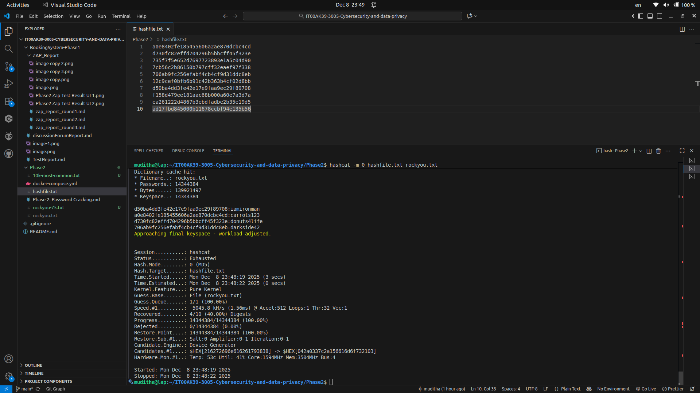
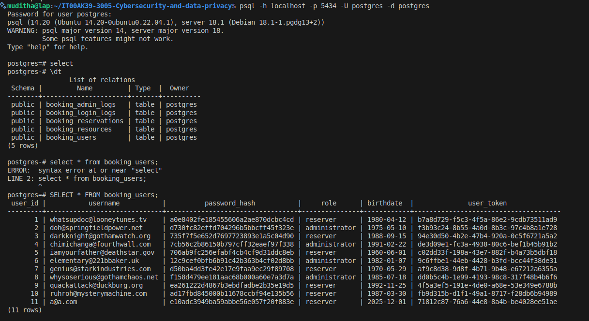

# 🛡️ Phase 2: Password Cracking Report

---

## 🔓 Cracked Password List

**Using:** `hashcat -m 0 hashfile.txt rockyou.txt`

| Hash                                   | Password      |
|----------------------------------------|--------------|
| d50ba4dd3fe42e17e9faa9ec29f89708       | iamironman   |
| a0e8402fe185455606a2ae870dcbc4cd       | carrots123   |
| d730fc82effd704296b5bbcff45f323e       | donuts4life  |
| 706ab9fc256efabf4cb4cf9d31ddc8eb       | darkside42   |

**Using:** `hashcat -m 0 hashfile.txt crackstation.txt`

| Hash                                   | Password      |
|----------------------------------------|--------------|
| f158d479ee181aac68b000a60e7a3d7a       | chaos123!    |
| 735f7f5e652d7697723893e1a5c04d90       | iamvengeance |

---

## 📋 Report Answers

### 1️⃣ Main difference between Dictionary and Non-Dictionary attacks
> **Dictionary attack:** Uses a predefined list of possible passwords (wordlist) to try against password hashes, making it fast if the password is common.  
> **Non-dictionary attack:** (e.g., brute-force or mask) tries all possible combinations of characters, which is much slower but can crack passwords not found in wordlists(in my machine can run just up to ?a 7 combination).

### 2️⃣ Advantage of having access to the system’s database with users and password hashes
> An attacker can target specific users, attempt to crack their password hashes offline, and use the information to impersonate users or escalate privileges. Knowing usernames and hashes allows for focused and efficient attacks (There for I could identify hashing with MD5 and directly attack using "-m 0").

### 3️⃣ Security benefits of longer passwords
> Longer passwords increase the number of possible combinations, making brute-force and guessing attacks much more difficult and time-consuming. This greatly improves resistance against both dictionary and non-dictionary attacks (in my machine can run maximum ?a 7 combination and need too much time when compare with 3 sets).

---

