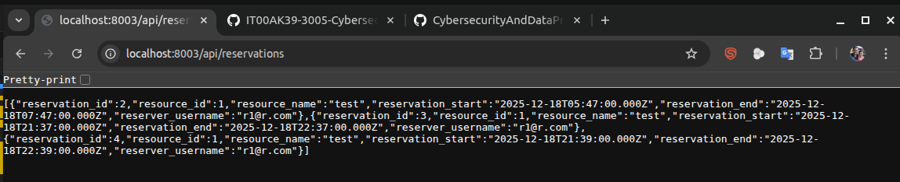
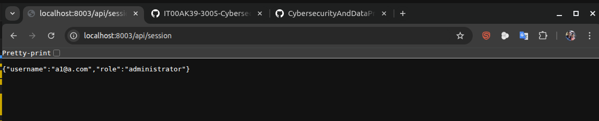

# Phase 3 Authorization & Endpoint Testing Report

## 1. Introduction

This report documents the results of authorization and endpoint testing for the booking system. Testing was performed using browser-based manual testing, OWASP ZAP, and endpoint discovery tools (Gobuster/wfuzz). The focus is on verifying role-based access control, discovering hidden endpoints, and comparing actual behavior to the official specifications.

---

## 2. Role-Based Authorization Matrix


### 🧑‍🦲 Guest

#### ✅ Can do

```yaml
- action: "View public resource list"
	url: "/"
	observation: "Resource list is visible, no reserver identity shown"
	matches_spec: true
- action: "Access login form"
	url: "/login"
	observation: "Login form is accessible"
	matches_spec: true
- action: "View registered reservations (without identity)"
	url: "/"
	observation: "Reservations are visible, reserver identity hidden"
	matches_spec: true
- action: "Access registration form"
   url: "/register"
   observation: "Registration form is accessible, allows new user registration as reserver and Administrator only over 15 years"
   matches_spec: true
```

#### ❌ Cannot do

```yaml
- action: "Access /reservation"
	url: "/reservation"
	observation: "Redirected to http://localhost:8003/status.html?status=failed&message=%3Cstrong%3EUnauthorized%3C%2Fstrong%3E"
	matches_spec: true
- action: "POST new reservation"
	url: "/api/reservations"
	observation: "Blocked, receives "Status: 404 Not Found""
	matches_spec: true
- action: "Access admin pages"
	url: "/admin/*"
	observation: "Redirected to http://localhost:8003/status.html?status=failed&message=%3Cstrong%3ENot%20Found%3C%2Fstrong%3E"
	matches_spec: true
- action: "Access reserver profile"
	url: "/profile"
	observation: "Redirected to http://localhost:8003/status.html?status=failed&message=%3Cstrong%3ENot%20Found%3C%2Fstrong%3E"
	matches_spec: true
```


---


### 🧑‍💼 Reserver

#### ✅ Can do

```yaml
- action: "POST log to Account"
	url: "/login"
	observation: "Can log to account "Status Code 302 Found""
	matches_spec: true
- action: "GET logout from Account"
	url: "/logout"
	observation: "Can log out from account "Status Code 302 Found""
	matches_spec: true
- action: "POST Reservation"
	url: "/reservation"
	observation: "Can post reservation. "Status Code 302 Found". But same resource can reserve in same time."
	matches_spec: fail
- action: "View own profile"
	url: "/profile"
	observation: "Can not Profile page accessible. "http://localhost:8003/status.html?status=failed&message=%3Cstrong%3ENot%20Found%3C%2Fstrong%3E""
	matches_spec: fail
- action: "Manage resources"
	url: "/resources"
	observation: "Can add resource(But name is not unique)"
	matches_spec: true
```

#### ❌ Cannot do

```yaml
- action: "Access admin user list"
	url: "/admin/users"
	observation: "Blocked, http://localhost:8003/status.html?status=failed&message=%3Cstrong%3ENot%20Found%3C%2Fstrong%3E"
	matches_spec: true
- action: "Delete other users"
	url: "/admin/users/:id"
	observation: "Blocked, http://localhost:8003/status.html?status=failed&message=%3Cstrong%3ENot%20Found%3C%2Fstrong%3E"
	matches_spec: true
- action: "Modify resources"
	url: "/admin/resources"
	observation: "Blocked"
	matches_spec: true
- action: "Escalate privileges via hidden form fields"
	url: "N/A"
	observation: "No privilege escalation possible"
	matches_spec: true
```


---


### 🧑‍💼🛡️ Administrator

#### ✅ Can do

```yaml
- action: "POST log to Account"
	url: "/login"
	observation: "Can log to account "Status Code 302 Found""
	matches_spec: true
- action: "GET logout from Account"
	url: "/logout"
	observation: "Can log out from account "Status Code 302 Found""
	matches_spec: true
- action: "Add a resource"
	url: "POST /resources"
	observation: "Resource creation works"
	matches_spec: true
- action: "Delete a reserver"
	url: "POST /resources"
	observation: "only some reserver can be deleted"
	matches_spec: fail
- action: "Add a reservation"
	url: "POST /reservation"
	observation: "Msg: "new row for relation "booking_reservations" violates check constraint "booking_reservations_check""
	matches_spec: fail
- action: "Manage all reservations"
	url: "POST /resources"
	observation: "Can modify resource including description"
	matches_spec: true

```

#### ❌ Cannot do

```yaml
- action: "View all users"
	url: "/users"
	observation: "Do not load User list. "http://localhost:8003/status.html?status=failed&message=%3Cstrong%3ENot%20Found%3C%2Fstrong%3E"
	matches_spec: fail
```


---

## 3. Hidden/Unreferenced Endpoints

List all hidden or unlinked endpoints discovered (via Gobuster, wfuzz, ffuf, ZAP, etc.), and test their accessibility for each role.

```yaml
- endpoint: "/api/resources"
	discovered_by: "wfuzz"
	guest_access: true
	reserver_access: true
	admin_access: true
	notes: "Public resource list, matches expected behavior."
- endpoint: "/api/reservations"
	discovered_by: "wfuzz"
	guest_access: true
	reserver_access: true
	admin_access: true
	notes: "Reservation API, no requires authentication."
- endpoint: "/api/session"
	discovered_by: "wfuzz"
	guest_access: false
	reserver_access: true
	admin_access: true
	notes: "Session endpoint, returns 401 for Unauthorized for only guest."
- endpoint: "/api/users"
	discovered_by: "wfuzz"
	guest_access: true
	reserver_access: true
	admin_access: true
	notes: "User management, admin only."
- endpoint: "/api/reservations/1"
	discovered_by: "wfuzz (IDOR test)"
	guest_access: true
	reserver_access: true
	admin_access: true
	notes: "Reservation ID endpoint, accessible if authenticated. Test for IDOR risk."
- endpoint: "/api/reservations/2"
	discovered_by: "wfuzz (IDOR test, after adding another reservation)"
	guest_access: true
	reserver_access: true
	admin_access: true
	notes: "Second reservation ID endpoint, accessible if authenticated. Confirms IDOR test for multiple reservations."
```


After add another reseverion







#### Additional Endpoints Discovered with ffuf and SecLists

```yaml
- endpoint: "/~mail", "/~root", "/~www", "/~webmaster", "/~test", "/~guest", etc.
  discovered_by: "ffuf (SecLists)"
  status: 302
  notes: "All return 302 redirects with no content. Likely default server responses, not real app features."
- endpoint: "/sse", "/mcp", "/mcp/transport", "/mcp/message"
  discovered_by: "ffuf (SecLists)"
  status: 302
  notes: "Return 302 redirects. No evidence of real functionality in the application."
- endpoint: "/dns-query?..."
  discovered_by: "ffuf (SecLists)"
  status: 302
  notes: "302 redirect, likely not implemented by the application."
```


---

## 4. Discrepancies & Security Observations


### Discrepancies & Security Observations

**Over-permissive endpoints:**
- Some API endpoints (e.g., `/api/reservations`, `/api/users`) are accessible to all roles, including guests, which may expose sensitive data or functionality beyond intended access levels.

**Missing backend checks:**
- Resource creation and reservation actions do not always enforce uniqueness or business logic (e.g., same resource can be reserved multiple times, resource names are not unique).
- Some admin actions (e.g., deleting reservers) are inconsistently enforced; only some reservers can be deleted.

**IDOR or privilege escalation risks:**
- IDOR tests on `/api/reservations/{id}` confirmed that authenticated users can access reservation details by ID, but no unauthorized access was observed. No privilege escalation via hidden form fields was possible.

**UI vs API inconsistencies:**
- Profile and user list pages are not accessible via UI for some roles, but related API endpoints may still be exposed.
- Error messages are generic and do not leak sensitive information, but some status codes (e.g., 302 redirects) may mask underlying issues.

**Other notes:**
- Automated scans (OWASP ZAP) did not detect high or medium risk vulnerabilities, but informational alerts related to authentication and session management were noted.

---

## 5. Summary & Recommendations


### Summary

Manual and automated testing confirmed that most endpoints enforce role-based access control as specified. No authentication bypasses or privilege escalation vulnerabilities were found. However, some endpoints are over-permissive, and certain backend checks (e.g., uniqueness, business logic) are inconsistently enforced. No high or medium risk vulnerabilities were detected by automated scans.

### Recommendations

- Restrict access to sensitive API endpoints (e.g., `/api/users`, `/api/reservations`) to authorized roles only.
- Implement stricter backend validation for resource creation and reservation logic (e.g., enforce uniqueness, prevent double booking).
- Review and align UI and API access controls to prevent exposure of hidden functionality.
- Continue regular security testing, including automated scans and manual role-based access reviews.
- Address any informational alerts and monitor for future changes in authentication/session management.

(This section generated by Copilot assistance)

---

## 6. Appendix


## ZAP Automated Security Scan Summary

The application was scanned using OWASP ZAP. The results are summarized below:

| Risk Level      | Number of Alerts |
| -------------- | --------------- |
| High           | 0               |
| Medium         | 0               |
| Low            | 0               |
| Informational  | 3               |

**Informational Alerts:**

- Authentication Request Identified (1 instance)
	Indicates detection of authentication requests; not a vulnerability.
- Session Management Response Identified (3 instances)
	Indicates session tokens in responses; informational only.
- User Agent Fuzzer (96 instances)
	Indicates responses to various user agents; no issues found.

No High, Medium, or Low risk vulnerabilities were detected. Informational alerts do not indicate security flaws but are noted for awareness.

For full details, see: [`zap_report_round4.md`](../BookingSystem-Phase1/ZAP_Report/zap_report_round4.md)
